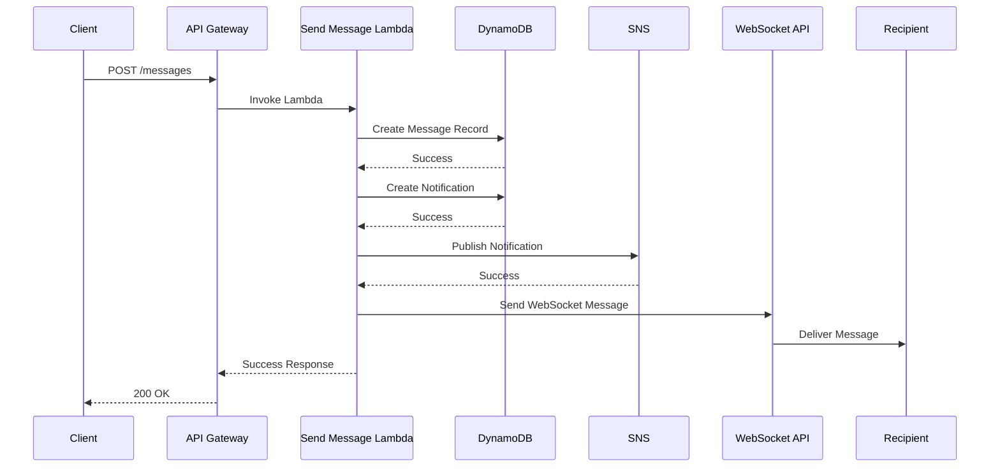

# Message Sending Flow

## Sequence Diagram

## Detailed Flow Description

### 1. Message Creation
1. Client sends POST request to `/messages` endpoint
2. Request includes:
   - `userId`: Recipient's ID
   - `content`: Message content
   - Authorization token

### 2. Lambda Processing
1. Lambda validates:
   - Required fields
   - Authorization
   - User existence
2. Creates message record with:
   - `messageId`: Generated UUID
   - `userId`: Recipient ID
   - `senderId`: From auth token
   - `content`: Message content
   - `read`: false
   - Timestamps

### 3. Notification Creation
1. Creates notification record with:
   - `notificationId`: Generated UUID
   - `userId`: Recipient ID
   - `type`: "message"
   - `title`: "New Message"
   - `content`: Formatted message preview
   - `read`: false
   - Timestamp

### 4. Push Notification
1. Publishes to SNS topic with:
   - Message type
   - User ID
   - Message ID
   - Content preview
2. SNS delivers to:
   - Mobile push notifications
   - Email notifications (if configured)

### 5. Real-time Delivery
1. Sends WebSocket message to recipient
2. Message includes:
   - Type: "message"
   - Message ID
   - Content
   - Sender ID
   - Timestamp

### 6. Response
1. Returns success response with:
   - Message ID
   - Created timestamp
   - Status

## Error Handling

### Validation Errors
- Missing required fields
- Invalid user ID
- Unauthorized access
- Returns 400 Bad Request

### Database Errors
- DynamoDB write failures
- Retries with exponential backoff
- Returns 500 Internal Server Error

### WebSocket Errors
- Connection not found
- Delivery failure
- Logs error but continues
- Doesn't affect response

### SNS Errors
- Topic not found
- Publish failure
- Logs error but continues
- Doesn't affect response

## Performance Considerations

### Optimizations
1. Parallel operations:
   - Database writes
   - SNS publish
   - WebSocket send
2. Error handling:
   - Non-blocking for non-critical operations
   - Retries for critical operations
3. Response time:
   - Returns after critical operations
   - Continues background tasks

### Monitoring
1. CloudWatch metrics:
   - Lambda duration
   - Error rates
   - Throttling
2. Alarms:
   - High error rates
   - Long durations
   - Failed deliveries

## Security

### Input Validation
1. Content length limits
2. Content type validation
3. User ID format validation
4. Authorization checks

### Data Protection
1. Message content encryption
2. Secure WebSocket connections
3. SNS message encryption
4. DynamoDB encryption at rest 