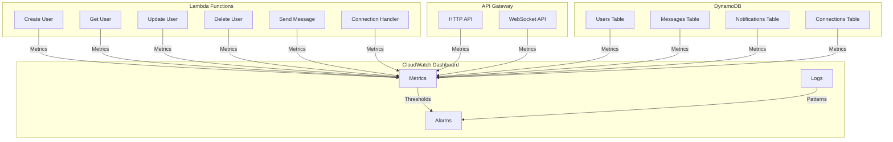

# Monitoring and Alerting

## CloudWatch Dashboard



## Monitoring Metrics

### Lambda Functions

#### Performance Metrics
1. **Duration**
   - Average execution time
   - P95/P99 latencies
   - Timeout occurrences
   - Threshold: 25 seconds

2. **Memory Usage**
   - Average memory utilization
   - Peak memory usage
   - Memory allocation efficiency
   - Threshold: 80% of allocated

3. **Concurrency**
   - Concurrent executions
   - Throttled requests
   - Provisioned concurrency usage
   - Threshold: 80% of limit

#### Error Metrics
1. **Error Rate**
   - Total errors
   - Error percentage
   - Error types distribution
   - Threshold: 1% error rate

2. **Cold Starts**
   - Cold start count
   - Cold start latency
   - Impact on performance
   - Threshold: 20% cold start rate

### API Gateway

#### HTTP API
1. **Request Metrics**
   - Total requests
   - 4xx errors
   - 5xx errors
   - Latency
   - Threshold: 5% error rate

2. **Throttling**
   - Throttled requests
   - Throttle rate
   - Client-side throttling
   - Threshold: 1000 requests/second

#### WebSocket API
1. **Connection Metrics**
   - Active connections
   - New connections
   - Disconnections
   - Connection errors
   - Threshold: 10000 connections

2. **Message Metrics**
   - Messages sent
   - Message latency
   - Failed deliveries
   - Threshold: 100ms latency

### DynamoDB

#### Performance
1. **Consumed Capacity**
   - Read capacity units
   - Write capacity units
   - Throttled requests
   - Threshold: 80% of provisioned

2. **Latency**
   - Read latency
   - Write latency
   - Consistent read latency
   - Threshold: 100ms

#### Errors
1. **Error Rates**
   - Throttled requests
   - System errors
   - User errors
   - Threshold: 1% error rate

## CloudWatch Alarms

### Critical Alarms

1. **Lambda Function Errors**
   ```json
   {
     "AlarmName": "LambdaErrors",
     "MetricName": "Errors",
     "Namespace": "AWS/Lambda",
     "Statistic": "Sum",
     "Period": 300,
     "EvaluationPeriods": 1,
     "Threshold": 0,
     "ComparisonOperator": "GreaterThanThreshold",
     "AlarmActions": ["arn:aws:sns:region:account:alerts"]
   }
   ```

2. **API Gateway 5xx Errors**
   ```json
   {
     "AlarmName": "APIGateway5xxErrors",
     "MetricName": "5XXError",
     "Namespace": "AWS/ApiGateway",
     "Statistic": "Sum",
     "Period": 300,
     "EvaluationPeriods": 1,
     "Threshold": 5,
     "ComparisonOperator": "GreaterThanThreshold",
     "AlarmActions": ["arn:aws:sns:region:account:alerts"]
   }
   ```

3. **WebSocket Connection Errors**
   ```json
   {
     "AlarmName": "WebSocketErrors",
     "MetricName": "ConnectionErrors",
     "Namespace": "AWS/ApiGateway",
     "Statistic": "Sum",
     "Period": 300,
     "EvaluationPeriods": 1,
     "Threshold": 10,
     "ComparisonOperator": "GreaterThanThreshold",
     "AlarmActions": ["arn:aws:sns:region:account:alerts"]
   }
   ```

### Warning Alarms

1. **High Latency**
   ```json
   {
     "AlarmName": "HighLatency",
     "MetricName": "Latency",
     "Namespace": "AWS/ApiGateway",
     "Statistic": "Average",
     "Period": 300,
     "EvaluationPeriods": 3,
     "Threshold": 1000,
     "ComparisonOperator": "GreaterThanThreshold",
     "AlarmActions": ["arn:aws:sns:region:account:warnings"]
   }
   ```

2. **High Memory Usage**
   ```json
   {
     "AlarmName": "HighMemoryUsage",
     "MetricName": "MemoryUsed",
     "Namespace": "AWS/Lambda",
     "Statistic": "Average",
     "Period": 300,
     "EvaluationPeriods": 3,
     "Threshold": 80,
     "ComparisonOperator": "GreaterThanThreshold",
     "AlarmActions": ["arn:aws:sns:region:account:warnings"]
   }
   ```

## Logging Strategy

### Lambda Function Logs

1. **Structured Logging**
   ```typescript
   {
     level: "INFO",
     timestamp: "2024-03-14T12:00:00Z",
     function: "sendMessage",
     requestId: "123e4567-e89b-12d3-a456-426614174000",
     userId: "user123",
     action: "message_sent",
     duration: 150,
     status: "success"
   }
   ```

2. **Error Logging**
   ```typescript
   {
     level: "ERROR",
     timestamp: "2024-03-14T12:00:00Z",
     function: "sendMessage",
     requestId: "123e4567-e89b-12d3-a456-426614174000",
     error: {
       name: "DynamoDBError",
       message: "Failed to write message",
       stack: "..."
     },
     context: {
       userId: "user123",
       messageId: "msg123"
     }
   }
   ```

### API Gateway Logs

1. **Access Logs**
   ```
   {
     requestId: "123e4567-e89b-12d3-a456-426614174000",
     ip: "192.0.2.1",
     caller: "user123",
     requestTime: "14/Mar/2024:12:00:00 +0000",
     httpMethod: "POST",
     resourcePath: "/messages",
     status: 200,
     protocol: "HTTP/1.1",
     responseLength: 123,
     integrationError: null
   }
   ```

2. **WebSocket Logs**
   ```
   {
     requestId: "123e4567-e89b-12d3-a456-426614174000",
     connectionId: "conn123",
     eventType: "CONNECT",
     timestamp: "2024-03-14T12:00:00Z",
     status: 200,
     latency: 50
   }
   ```

## Alerting Channels

### SNS Topics

1. **Critical Alerts**
   - Immediate notification
   - High priority
   - On-call rotation
   - Slack integration

2. **Warning Alerts**
   - Business hours
   - Medium priority
   - Team channel
   - Email notification

### Dashboard

1. **Real-time Metrics**
   - Current system status
   - Active alerts
   - Performance metrics
   - Error rates

2. **Historical Data**
   - Trend analysis
   - Capacity planning
   - Performance optimization
   - Cost analysis 