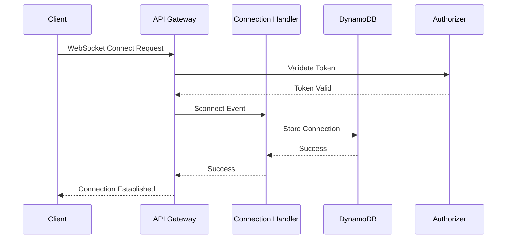
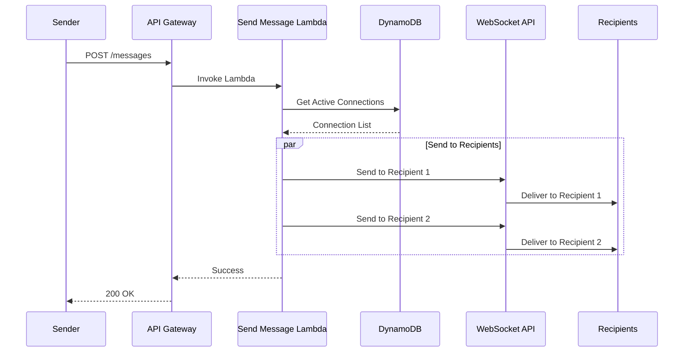
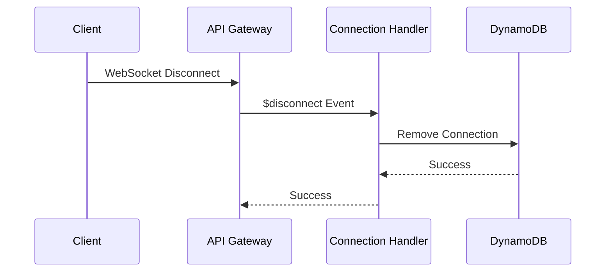

# WebSocket Connection Flow

## Connection Establishment

## Message Broadcasting

## Connection Termination

## Detailed Flow Description

### 1. Connection Establishment
1. Client initiates WebSocket connection
2. API Gateway validates connection request
3. Connection Handler Lambda:
   - Validates user authentication
   - Stores connection in DynamoDB
   - Associates connection with user
4. Connection established

### 2. Message Broadcasting
1. Message sending:
   - Lambda retrieves active connections
   - Filters by recipient criteria
   - Sends to each active connection
2. Connection management:
   - Handles failed deliveries
   - Removes stale connections
   - Updates connection status

### 3. Connection Termination
1. Client disconnects
2. API Gateway triggers disconnect event
3. Connection Handler:
   - Removes connection from DynamoDB
   - Updates user status
   - Cleans up resources

## Connection Management

### Storage
1. DynamoDB table structure:
   - Primary Key: `connectionId`
   - GSI: `userId`
   - Attributes:
     - `userId`
     - `timestamp`
     - `status`

### Connection States
1. Active:
   - Recent activity
   - Valid authentication
   - No errors
2. Stale:
   - No recent activity
   - Pending cleanup
3. Terminated:
   - Explicit disconnect
   - Error state
   - Removed from storage

## Error Handling

### Connection Errors
1. Authentication failures:
   - Invalid tokens
   - Expired sessions
   - Returns 401 Unauthorized
2. Connection failures:
   - Network issues
   - Timeout
   - Returns 503 Service Unavailable

### Message Delivery Errors
1. Connection not found:
   - Logs error
   - Continues to next recipient
2. Delivery timeout:
   - Retries with backoff
   - Marks connection stale
3. Permanent failures:
   - Removes connection
   - Notifies user

## Performance Optimization

### Connection Management
1. Connection pooling:
   - Limits per user
   - Automatic cleanup
   - Resource optimization
2. Message batching:
   - Groups messages
   - Reduces API calls
   - Improves throughput

### Monitoring
1. Connection metrics:
   - Active connections
   - Connection duration
   - Error rates
2. Performance metrics:
   - Message latency
   - Delivery success
   - Resource usage

## Security

### Authentication
1. Token validation:
   - JWT verification
   - Expiration check
   - Scope validation
2. Connection validation:
   - IP restrictions
   - Rate limiting
   - Protocol validation

### Data Protection
1. Message encryption:
   - TLS for WebSocket
   - Message encryption
   - Secure storage
2. Access control:
   - User isolation
   - Connection limits
   - Resource quotas 